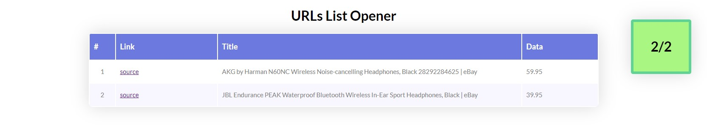

# URLs List Opener

This is a little application to open a list o URLs and extract data from its content.

## How to use it

- Write your URLs inside `list.txt` separated by a new line.
- Open `single.php` and edit "Data delimiters" variables to find what you are looking for.
- (optional) Open `index.html` and add options to `.uloOpen()` in JS (see below).

### JS options

| Property   | Type    | Default        | Description                                                  | Example                     |
| ---------- | ------- | -------------- | ------------------------------------------------------------ | --------------------------- |
| `listPath` | string  | `'list.txt'`   | Path to the file containing the list                         | `'my_folder/my_list.txt'`  |
| `engine`   | string  | `'single.php'` | Path to the PHP file for reading and extract data            | `'my_folder/my_engine.php'` |
| `delay`    | integer | `2000`         | Delay time in milliseconds between every request. Useful to avoid being detected as spam |                             |

``````javascript
$( "#ulo-table-body" ).uloOpen({
    listPath: 'my_list.txt'
});
``````

### JS Layout options
You can choose where to print the application output:
``````javascript
$( ".my-table tbody" ).uloOpen({
    statusSelector:   '.my-status',
    currentSelector:  '.my-current',
    totalSelector:    '.my-total'
});
``````

## Screen Shots
